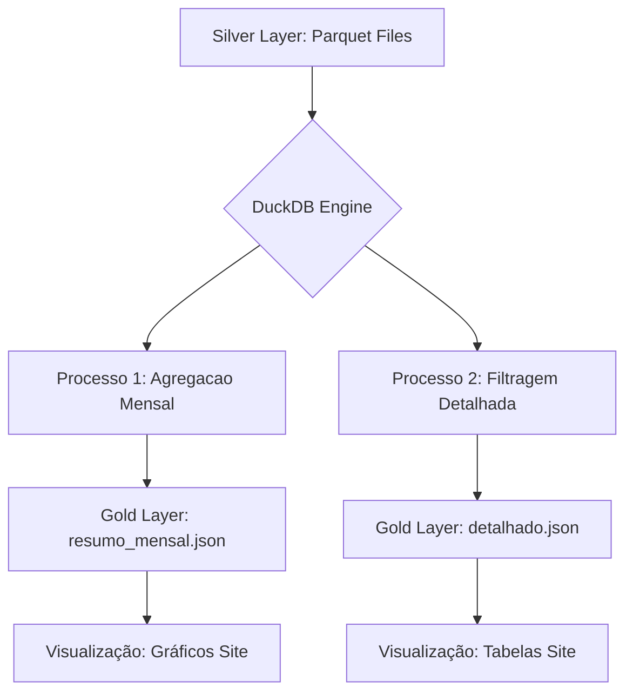

# Estrutura da Automação: Camada Gold (Consumo Web)

Este documento detalha a lógica de exportação dos dados da **Silver** para a **Gold** utilizando **DuckDB** para transformar arquivos Parquet em JSON otimizado para consumo no site.

## 1. Objetivo
Disponibilizar os dados consolidados para o front-end de forma leve e nativa para o navegador (JSON), permitindo visualizações instantâneas no site hospedado no GitHub Pages.

## 2. Fluxo de Processos (Pipeline de Consumo)



### Estratégia de Processamento:
- **Input**: `fato_renda.parquet` & `fato_despesa.parquet`
- **Engine**: DuckDB SQL
- **Output**: `*.json` (Otimizados para BI Web)

## 3. Por que usar DuckDB na Gold?
O DuckDB é a escolha ideal para esta etapa por três motivos principais:
1.  **Exportação Nativa de JSON**: Permite converter Parquet para JSON com uma única query SQL (`COPY (...) TO ... FORMAT JSON`).
2.  **Agregações de Performance**: Realiza somas e agrupamentos complexos em milissegundos, enviando para o site apenas o que ele precisa exibir (ex: totais mensais).
3.  **Consistência**: Mantém o mesmo motor de dados utilizado na camada Silver, facilitando a manutenção do código.

## 3. Tecnologias e Caminhos
- **Engine:** `duckdb`
- **Origem (Silver):** `Dados/2_Silver/*.parquet`
- **Destino (Gold):** `Dados/3_Gold/*.json`

## 4. Lógica de Transformação JSON

### A. Resumo Mensal (Agregado)
Query para gerar dados prontos para gráficos:
```sql
SELECT 
    Data_Competencia,
    Mes_Sigla,
    Ano,
    SUM(Valor) AS Total_Valor
FROM read_parquet('Dados/2_Silver/fato_despesa.parquet')
GROUP BY 1, 2, 3
ORDER BY Data_Competencia;
```

### B. Detalhado (Transações)
Query para tabelas de busca:
```sql
SELECT 
    Data_Referencia,
    Item,
    Valor,
    Status,
    Credor
FROM read_parquet('Dados/2_Silver/fato_despesa.parquet')
WHERE Status != 'Cancelado';
```

## 5. Implementação no Site
O front-end consome os dados diretamente via `fetch`:
```javascript
async function loadData() {
  const response = await fetch("../Dados/3_Gold/resumo_mensal.json");
  const data = await response.json();
  console.log("Dados da Gold prontos para o gráfico:", data);
}
```

---
*Esta Skill deve ser seguida para garantir que o site sempre exiba a versão mais recente e performática dos dados financeiros.*
