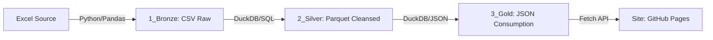

# Automação Financeira: Arquitetura Medalhão 🥇

Este projeto automatiza a extração e transformação de dados financeiros pessoais de arquivos Excel, seguindo a **Arquitetura Medalhão** (Bronze, Silver e Gold) para garantir qualidade, rastreabilidade e prontidão para o consumo web.

## 🚀 Novidades Recentes (v4.0)
- **Extração Inteligente (Renda)**: Implementada a `STOP_CONDITION` dinâmica, detectando automaticamente o fim dos dados por palavra-chave ("Total de Renda") ou por 2 linhas vazias consecutivas no `extractor.py`.
- **Ecossistema de Skills**: Documentação técnica e regras de negócio agora integradas ao repositório em `.agents/skills/`, garantindo que o conhecimento do pipeline seja versionado.
- **Validação Integrada**: Script `validate_results.py` adicionado para conferência rápida dos dados processados nas camadas Bronze e Silver.
- **Fase Gold (Draft)**: Planejamento da camada de consumo via JSON usando DuckDB para máxima performance no front-end.

## 🏗️ Arquitetura do Pipeline



### 1. Camada Bronze (Raw)
- **Script**: `extractor.py`
- **O que faz**: Consolida abas mensais (Jan-Dez) ignorando ruídos (abas de Viagem) e salva os dados brutos em CSV.
- **Diferencial**: Detecção inteligente de início e fim de blocos de dados sem limites fixos de linha.

### 2. Camada Silver (Refined)
- **Script**: `silver_transform.py`
- **O que faz**: Utiliza o motor SQL do DuckDB para limpar nulos, padronizar valores monetários e criar a `Data_Competencia` (essencial para Power BI/Gráficos).
- **Formato**: Parquet (colunar, leve e rápido).

### 3. Camada Gold (Business)
- **O que faz**: Geração de arquivos JSON agregados (`resumo_mensal.json`) para visualização no site hospedado via GitHub Pages.

## 🛠️ Tecnologias Utilizadas
- **Linguagem**: Python 3.x
- **Manipulação de Dados**: Pandas & DuckDB
- **Engine SQL**: DuckDB (Processamento in-memory em milissegundos)
- **Armazenamento**: CSV, Parquet e JSON
- **Versionamento**: Git & GitHub (Repositório Privado)

## 📁 Estrutura do Projeto
```text
teste_antgravity/
├── .agents/skills/       # Documentação técnica (Bronze/Silver/Gold)
├── Dados/
│   ├── 1_Bronze/         # Dados brutos consolidados (CSV)
│   ├── 2_Silver/         # Dados limpos e tipados (Parquet)
│   └── 3_Gold/           # Dados para o site (JSON)
├── extractor.py          # Script de extração Excel
├── silver_transform.py   # Script de refinamento SQL
├── validate_results.py   # Script de validação de dados
└── README.md             # Documentação principal
```

---
*Desenvolvido para transformar planilhas complexas em dashboards interativos.*
