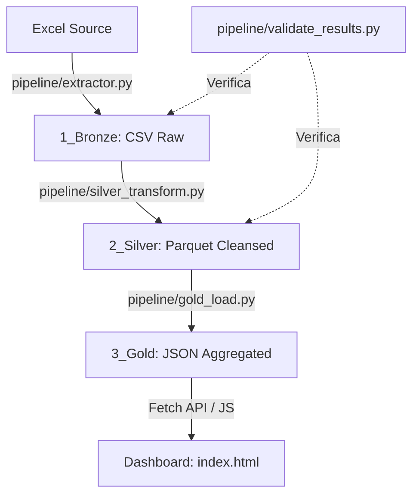

# Automação Financeira: Link do Projeto

https://luanchristiansilva.github.io/automacao-financeira-medalhao/index.html

# Automação Financeira: Arquitetura Medalhão 🥇 (v7.0)

Este projeto automatiza a extração e transformação de dados financeiros pessoais de arquivos Excel, seguindo a **Arquitetura Medalhão** (Bronze, Silver e Gold), integrando um pipeline robusto em Python com um dashboard executivo moderno.

## 🚀 Novidades Recentes (v7.0)
- **Segurança Blindada**: Implementação de `.gitignore` recursivo e limpeza de histórico para proteção de dados reais.
- **Lógica de Crédito Corrigida**: Nova fórmula de comprometimento de renda e inclusão de valores monetários absolutos (R$).
- **Dashboard Online Seguro**: Publicação oficial de dados simulados (Mock) para visualização pública sem riscos.
- **Gestão de Roadmap**: Desativação temporária da página de Investimentos com camada de proteção (Shield) e preservação de código.

## 🚀 Novidades Anteriores (v5.0/v6.0)
- **Dashboard Refinado**: Reorganização dos KPIs para layout de 3 colunas, melhorando a densidade de informação.
- **Consolidação de Renda**: Nova visualização em barras horizontais para "Distribuição da Renda" integrando valores diretamente na legenda.
- **UI Premium**: Implementação total com Bootstrap 5.3, suporte a valores negativos sem quebra de linha e sparklines otimizadas.
- **Pipeline Organizado**: Todos os scripts de processamento agora residem na pasta `pipeline/`, com orquestração centralizada no `main.py`.
- **Validação de Consistência**: Script de validação automática rodando ao final do pipeline para garantir integridade entre camadas.

## 🏗️ Arquitetura do Sistema



### 1. Camada Bronze (Extração)
- **Script**: `pipeline/extractor.py`
- Consolida múltiplas abas mensais, utilizando detecção dinâmica de fim de dados (`STOP_CONDITION`).

### 2. Camada Silver (Refinamento)
- **Script**: `pipeline/silver_transform.py`
- Limpeza e padronização usando **DuckDB SQL**. Criação de dimensões temporais para análise histórica.

### 3. Camada Gold (Consumo)
- **Scripts**: 
    - `pipeline/gold_load.py`: Dados históricos e agregados simples.
    - `pipeline/gold_indicators.py`: Indicadores complexos, alertas e gestão de parcelas.
- Gera arquivos JSON (`indicadores_acao.json`, `metas_poupanca.json`) otimizados para consumo instantâneo.

## 🛠️ Tecnologias
- **Python 3.x**: Motor principal da pipeline.
- **DuckDB**: Engine SQL de alta performance (in-memory).
- **Bootstrap 5.3**: Layout responsivo e componentes UI modernos.
- **Chart.js**: Gráficos de Gauge e Sparklines.
- **Pandas**: Suporte a leitura de Excel e CSV.

## 📁 Estrutura do Repositório
```text
teste_antgravity/
├── Dados/
│   ├── 1_Bronze/         # CSVs consolidados (Raw)
│   ├── 2_Silver/         # Parquet (Performance & Cleansed)
│   └── 3_Gold/           # JSON (BI & Alertas IA)
├── pipeline/             # Scripts da arquitetura medalhão
│   ├── utils/            # Helpers (Logger, etc.)
│   ├── extractor.py
│   ├── silver_transform.py
│   ├── gold_indicators.py
│   ├── generate_mock_data.py # Gerador de dados fictícios para Web
│   └── validate_results.py
├── css/ & js/            # Dashboard Assets (indicators.js, etc.)
├── indicadores.html      # Página Principal de Gestão
├── main.py               # Orquestrador End-to-End
└── README.md             # Documentação Principal
```

## 🖥️ Navegação e Funcionalidades

O dashboard é dividido em 3 visões estratégicas, acessíveis pela barra lateral:

### 1. Visão Geral (`index.html`)
- **Foco**: Fluxo de caixa imediato e categorização.
- **Destaques**: Gráfico de histórico mensal (Renda vs Despesa), distribuição de gastos por categoria e lista completa de transações do mês selecionado.

### 2. Indicadores Estratégicos (`indicadores.html`)
- **Foco**: Consultoria financeira ativa e gestão de passivos.
- **Destaques**: 
    - **Alertas de IA**: Feedback contextual sobre a saúde do seu saldo.
    - **Impacto de Dívidas**: Percentual de comprometimento da renda.
    - **Gestão de Parcelas**: Tabela dinâmica com progresso real e tempo para quitação de cada dívida.

### 3. Metas de Poupança (`poupanca.html`)
- **Status**: 🛑 Temporariamente desabilitada (Em desenvolvimento).
- **Funcionalidade**: Planejamento de futuro e reserva de emergência. Acessível via código mas protegida por shield de redirecionamento na versão atual.

## 🏁 Como Executar
Basta rodar o orquestrador na raiz do projeto:
```bash
python main.py
```
O pipeline executará todas as camadas, validará os dados e abrirá o dashboard automaticamente no seu navegador padrão.

---
*Transformando planilhas em inteligência financeira.*
